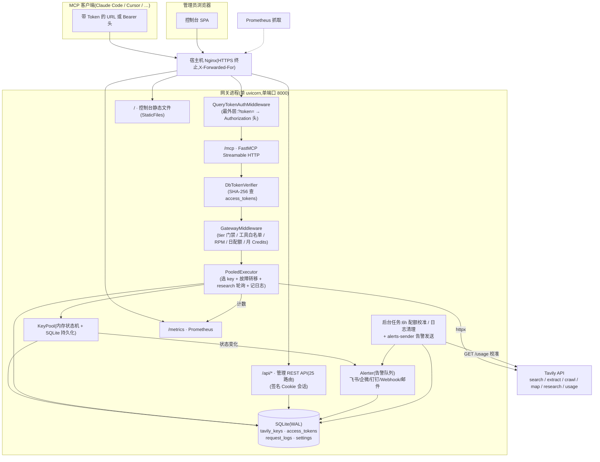
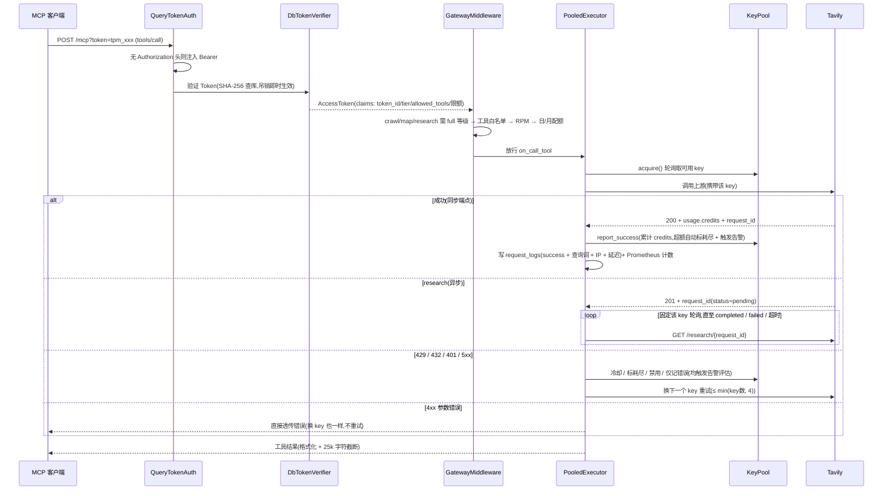
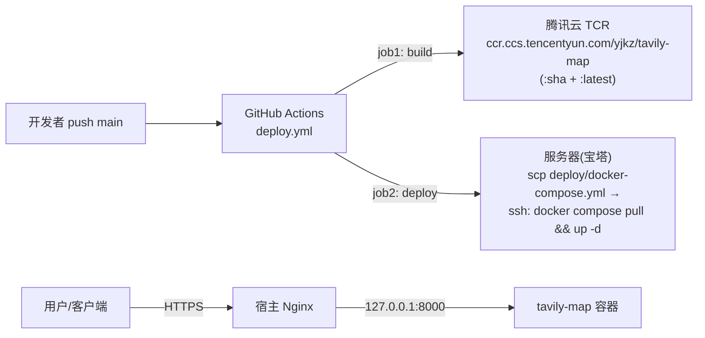

# 02 · 整体架构

## 分层架构图



## 一次工具调用的完整流转



## 为什么是"单进程单端口"

顶层 ASGI 应用直接用 `mcp.http_app(path="/mcp")` 的返回值,再把管理路由、健康检查、静态文件**追加**到它的 `routes` 列表。这是 FastMCP 官方推荐的 ASGI 集成方式,关键原因:

- 若把 MCP app **Mount** 进自建 Starlette,子应用的 lifespan 不会执行,MCP 会话管理器无法启动
- 本项目把自定义 lifespan 传给 **FastMCP 构造器**(`FastMCP(lifespan=...)`),由 `http_app()` 的 lifespan 统一驱动,数据库连接、KeyPool 加载、后台任务都在同一个生命周期里

组装顺序见 `app/main.py:create_app()`:

```
mcp.http_app(path="/mcp")          # 路由表首项是 /mcp
  .routes += /health               # 健康检查(无鉴权)
  .routes += /metrics              # Prometheus 指标(无鉴权,只有聚合数值)
  .routes += build_admin_routes()  # 25 条 /api/* 与公开的 /site-icon、/api/public-info
  .routes += Mount("/", StaticFiles(dashboard/dist))  # 静态托管放最后兜底
最后整体包一层 QueryTokenAuthMiddleware 返回
```

> **实测教训**:`?token=` 提升中间件最初通过 `http_app(middleware=[...])` 注入,但 FastMCP 的 `AuthenticationMiddleware` 位于用户中间件**外层**、更早读取 Authorization 头,导致注入无效。因此该中间件必须包裹在**整个 app 最外层**(见 `main.py` 末尾注释)。

## 启动流程(lifespan)

1. `load_config()`:读环境变量;`ADMIN_PASSWORD` 必填(或 dev 模式默认 `admin`);`SESSION_SECRET` 缺省时自动生成并持久化到 `DATA_DIR/session_secret`
2. `db.connect()`:打开 SQLite、WAL、busy_timeout,执行 `SCHEMA` 建表,`_migrate()` 补列(`token_enc`、`allowed_tools`、`client_ip`、`query`)
3. `pool.load()`:全量加载 `tavily_keys` 到内存
4. 启动两个后台任务:`usage-sync`(每 6h 校准全部 key)、`maintenance`(每 6h 月度滚动 + 删过期日志);两者每轮结束都调 `alerter.pool_check()` 评估池健康
5. `alerter.start()`:起 `alerts-sender` 后台任务消费告警队列(webhook/邮件异步发送)
6. 开始服务;关闭时反向清理(取消任务 → 关 httpx → 关 alerter → 关 DB)

## 部署拓扑(当前生产环境)



- CI 需要 4 个 secrets:`DOCKER_PASSWORD`、`SERVER_HOST`、`SERVER_USER`、`SERVER_SSH_KEY`
- 两个 job 均绑定 GitHub Environment `腾讯云4h4g`(可用于审批/环境密钥)
- 容器仅绑定 `127.0.0.1:${APP_PORT:-8000}`,公网只暴露 Nginx 的 443
