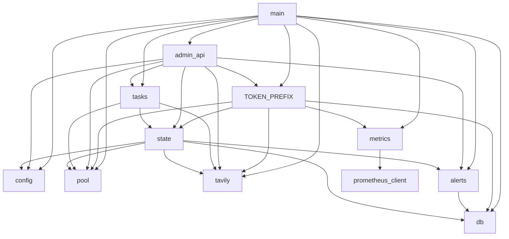

# 03 · 后端核心模块

覆盖 `app/` 下除 `mcp_server.py`、`admin_api.py` 以外的全部模块(这两个见 [04](04-MCP服务层.md) / [05](05-管理API.md))。

## 模块依赖关系



依赖方向单一(入口 → 业务 → 基础),无环;`state.py` 是唯一的全局状态点。

---

## config.py — 配置加载

| 项 | 说明 |
|---|---|
| `Config`(frozen dataclass) | 13 个字段:admin_password / session_secret / data_dir / host / port / cooldown_seconds / usage_sync_interval_hours / log_retention_days / default_token_rpm / max_retries / character_limit / cookie_secure / dev_mode |
| `load_config()` | 环境变量 → Config;仅此一个入口 |

加载规则要点:

- `ADMIN_PASSWORD` 未设且非 dev 模式 → 直接 `RuntimeError` 拒绝启动(防公网裸奔);`TAVILY_POOL_DEV=1` 时默认 `admin`
- `SESSION_SECRET` 缺省 → `secrets.token_urlsafe(48)` 生成并**写文件持久化**到 `DATA_DIR/session_secret`(重启后会话与 Token 加密不失效)
- `COOKIE_SECURE` 默认:dev 模式 `0`(否则 httpx/浏览器会拒收 http 上的 Secure Cookie),生产 `1`

## db.py — SQLite 封装

`Database` 类,单条共享 aiosqlite 连接(aiosqlite 在后台线程串行执行语句,协程并发安全):

| 方法 | 说明 |
|---|---|
| `connect()` / `close()` | 打开连接、`PRAGMA journal_mode=WAL` + `busy_timeout=5000`、执行 `SCHEMA` 建表、`_migrate()` |
| `_migrate()` | 增量列迁移:老库补 `access_tokens.token_enc`、`request_logs.client_ip` |
| `execute(sql, params) -> lastrowid` | 写入并 commit |
| `fetchone / fetchall` | 查询,`aiosqlite.Row` 行工厂(可按列名取值) |
| `get_setting / set_setting / delete_setting` | `settings` 键值表读写(UPSERT 写法),设置体系唯一入口 |

`SCHEMA` 常量含 4 张表的 `CREATE TABLE IF NOT EXISTS` + 3 个日志索引(见 [06](06-数据模型.md))。

## state.py — 全局状态单例

```python
@dataclass
class AppState:
    config: Config
    db: Database
    pool: KeyPool
    tavily: TavilyClient
```

`set_state()` 在 `create_app()` 里装配一次,`get_state()` 供 admin_api / tasks 取用。选择模块级单例而非 FastMCP lifespan 上下文传递,是为了让管理路由和后台任务(不在 MCP 请求上下文里)也能拿到同一份状态。

## tavily.py — Tavily 上游客户端

所有 Tavily 线上协议知识集中在此:

| 成员 | 说明 |
|---|---|
| `TavilyError(status, detail)` | `status=0` 表示网络/超时错误(可换 key 重试);其余为上游 HTTP 码 |
| `_error_detail(resp)` | 解析错误体,Tavily 的 `detail` 可能是 `{"error": "..."}` 嵌套结构或字符串 |
| `parse_usage(body)` | **核心**:`/usage` 响应归一化 |
| `TavilyClient` | `search / extract / crawl / map_url / research / get_research / usage` 七个方法,统一 Bearer 头、60s 超时、`_request` 统一错误包装;`research` 提交异步任务(201),`get_research(request_id)` 轮询结果 |

`parse_usage` 的关键逻辑(踩过坑):**Tavily 只在 key 配了独立限额时才返回 key 级数字**,否则 `key.usage` 恒 0、`key.limit` 为 null,真实月度配额在 `account.plan_usage / plan_limit`。因此:

```python
used, limit = key.usage, key.limit        # 先取 key 级
if limit is None:                          # key 级没配额 →
    used, limit = account.plan_usage, account.plan_limit   # 账户级回退
    source = "account"
```

返回 `{credits_used, plan_limit, remaining, plan, source, raw}`,`source` 会一路透出到"测试连接"的 toast(显示"按账户配额")。

## pool.py — KeyPool 调度器(项目心脏)

**时间工具**:`month_start_ts / day_start_ts / next_month_start_ts`(UTC 对齐)。

**`KeyState`(内存态,镜像数据库行)**:

| 属性 | 说明 |
|---|---|
| `effective_status` | 计算属性:冷却到期懒恢复;`credits_used_month >= plan_limit` 视为耗尽;显式 `exhausted`(上游 432/433)不会被本地额度判断"复活",只能由 usage 校准或月度滚动恢复 |
| `remaining_credits` | `max(0, plan_limit - credits_used_month)` |

**`KeyPool`**:

| 方法 | 说明 |
|---|---|
| `acquire() -> KeyState \| None` | 加锁轮询,跳过非 active;全池不可用返回 None。**只在内存判断,不写库** |
| `report_success(ks, credits)` | 累计调用数/credits/时间;跨过 `plan_limit` 自动置 exhausted 并触发告警 |
| `report_rate_limited(ks)` | 置 cooling,`cooldown_until = now + cooldown_seconds`(默认 60s);触发池级告警检查 |
| `report_exhausted / report_invalid` | 置 exhausted(432/433)/ disabled(401),并触发对应告警 |
| `report_transient` | 5xx/网络错误:只记 `last_error`,**不惩罚状态** |
| `apply_usage(key_id, ...)` | 用真实 `/usage` 校准额度;exhausted/cooling 且有余额 → 自动恢复,返回是否恢复。**付费 key 兼容点**:账户级回退拿到的真实 `plan_limit` 在此写回 |
| `roll_month_if_needed()` | `monthly_reset_at` 到期 → 清零月计数、exhausted→active(usage 校准会再核实) |
| `add_keys / remove_key / set_enabled / update_meta` | 控制台管理入口,写库后 `load()` 重载内存 |
| `next_recovery_hint()` | 全池不可用时给客户端的恢复预估文案 |

所有 `report_*` 都是"改内存(锁内)+ 单条 UPDATE 持久化",崩溃后重启以数据库为准。构造函数可注入 `alerter`(`app/alerts.py`),状态变化时异步推送告警(见下)。

## alerts.py — Webhook / 邮件告警

队列化设计:请求热路径只做"配置检查(60s 缓存)+ 去重判断 + 入队",实际发送(webhook HTTP / 邮件 SMTP)由后台 `alerts-sender` 任务完成,**发送失败也不阻塞工具调用**。

| 事件 | 触发点 | 默认 | 去重 |
|---|---|---|---|
| `key_disabled` | `report_invalid`(401) | 开 | 同 key 30 分钟 |
| `key_exhausted` | `report_exhausted` / `report_success` 跨限 | 关 | 同 key 30 分钟 |
| `pool_exhausted` | `pool_check` 发现可用 key = 0 | 开 | 10 分钟 |
| `pool_recovered` | 死池 → 有可用 key 的状态翻转 | 开(翻转即发) | — |
| `pool_low_active` | 可用 key ≤ 阈值(默认关) | 关 | 10 分钟 |
| `pool_low_remaining` | 全池剩余 credits ≤ 阈值(默认关) | 关 | 10 分钟 |

- `pool_check` 在每次 key 状态变化后、usage-sync 与 maintenance 周期里被调用
- 渠道:飞书 / 企业微信 / 钉钉(后两者支持 HMAC 签名,飞书签名为"字符串作 key 的空消息 HMAC",钉钉为"secret 作 key")/ 通用 JSON POST / **邮件(SMTP)**
- 邮件渠道:只发信所以**不需要 IMAP**;字段为 SMTP 服务器、端口(465=SSL / 587=STARTTLS)、SSL 开关、发信邮箱、密码/授权码(163/QQ 等)、可选发件人、逗号分隔的收件人。发送用标准库 `smtplib`,经 `asyncio.to_thread` 在工作线程执行,不阻塞事件循环
- 发件人容错(`_sender_address`):留空 = 登录邮箱;含 `@` 原样使用(裸地址或 `名字 <地址>` 完整格式);**纯显示名**(如 `Tavily Pool 网关`)自动转为 `"显示名" <登录邮箱>`——避免被 EmailMessage 解析成非法的多地址/国际化地址而报错
- 配置全部存 `settings` 表(`alert_*` 键),设置页可改,控制台有「发送测试告警」按钮(直发,同步返回结果)
- `flush()` 供测试与测试按钮立即清空队列

## metrics.py — Prometheus 指标

- `tpm_requests_total{tool,status}` / `tpm_credits_total`:在 `log_request()` 里递增(每次落日志即计数)
- `tpm_pool_keys{status}` / `tpm_pool_remaining_credits` / `tpm_tokens_active`:gauge,在 `/metrics` 被抓取时从内存池快照与 SQL 实时计算
- 依赖 `prometheus-client`, exposition 走默认 registry(自带 python 进程指标)

状态机全图见 [06-数据模型](06-数据模型.md)。

## tasks.py — 后台任务

| 任务 | 周期 | 逻辑 |
|---|---|---|
| `usage_sync_loop` | 6h(首次启动立即跑) | 遍历非 disabled key 调 `GET /usage`;401 → 直接禁用;解析成功 → `apply_usage` 校准/恢复。单个 key 失败不影响其他 |
| `maintenance_loop` | 6h | `roll_month_if_needed()` 月度滚动;`DELETE FROM request_logs WHERE ts < strftime('%s','now','-N days')` 清理过期日志 |

两个循环都整体 try/except:单轮异常只记日志,下一周期重试。`start_background_tasks()` 在 lifespan 里 create_task,退出时统一 cancel + gather。

## main.py — 入口与组装

| 成员 | 说明 |
|---|---|
| `QueryTokenAuthMiddleware`(定义在 mcp_server,此处使用) | 最外层纯 ASGI 中间件:`?token=` 且无 Authorization 头 → 注入 `Bearer`,复制新 scope 不污染原对象 |
| `create_app()` | 详见 [02 · 启动流程];前端未构建时 `/` 返回提示 JSON 而非 404 |
| `app = create_app()` | 模块级实例,`uvicorn app.main:app` 引用 |
