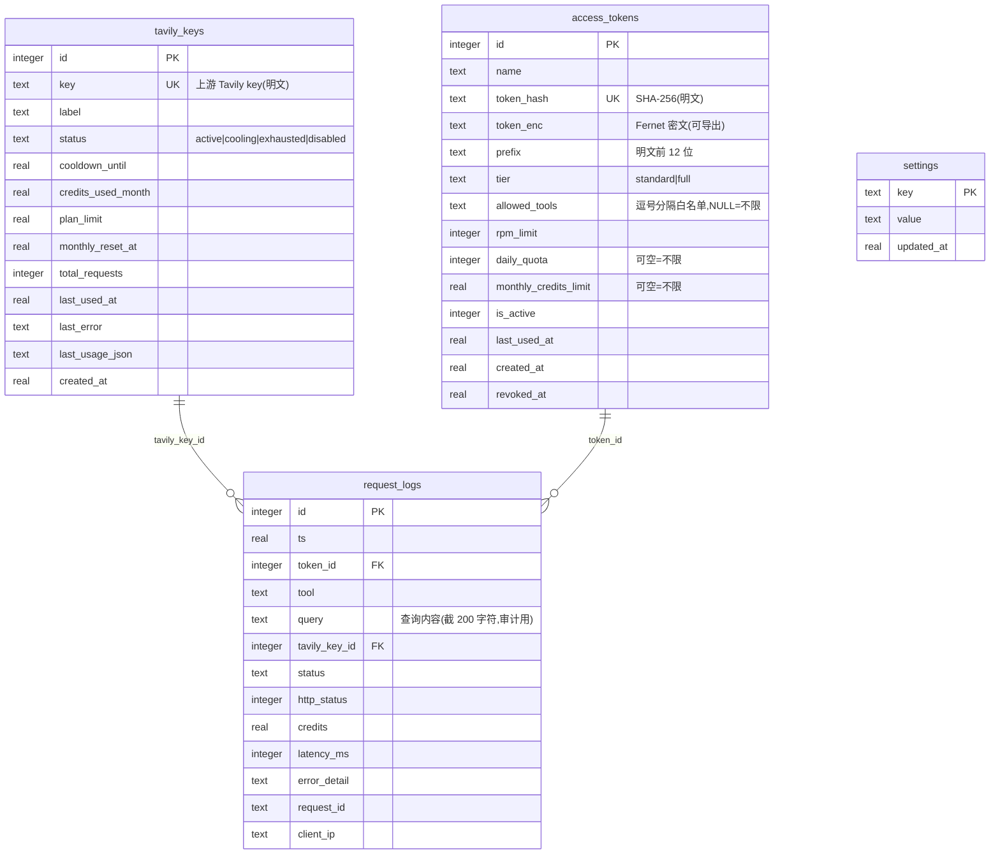
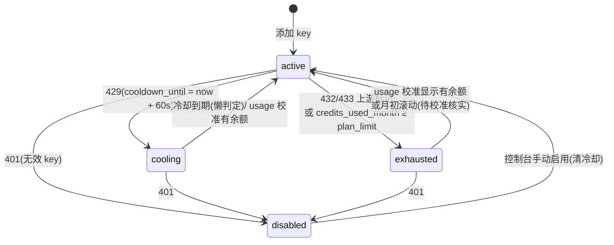

# 06 · 数据模型

存储层 = SQLite 单库(默认 `DATA_DIR/tavily_pool.db`)+ `DATA_DIR` 下少量文件。全部 DDL 在 `app/db.py` 的 `SCHEMA` 常量里,启动时 `CREATE TABLE IF NOT EXISTS` 幂等执行。

## 表关系总览



> 外键是**逻辑上的**(DDL 未声明 FOREIGN KEY 约束):key/token 删除后历史日志保留,LEFT JOIN 查不到时前端显示 `-`。

## tavily_keys — Key 池状态

内存中的 `KeyState` 是该表的逐字段镜像(见 [03 · pool.py](03-后端核心模块.md));`report_*` 系列在锁内改内存后单条 UPDATE 持久化。

| 字段 | 说明 |
|---|---|
| `key` | 上游 Tavily key 明文(需原样转发上游,加密收益有限;靠服务器权限保护) |
| `status` | **存储态**:`active` / `cooling` / `exhausted` / `disabled` |
| `cooldown_until` | 429 冷却截止时间戳;到期由 `effective_status` 懒恢复,**不回写** |
| `credits_used_month` / `plan_limit` | 本月已用/总配额(credits)。默认 1000(免费计划) |
| `monthly_reset_at` | 下次月初(UTC)时间戳,月度滚动的触发依据 |
| `total_requests` | 历史成功调用总数(不含失败) |
| `last_usage_json` | 最近一次 `/usage` 原始响应(审计用) |

## access_tokens — 下发凭证

校验流程见 [04 · DbTokenVerifier](04-MCP服务层.md)。要点:

- `token_hash` 唯一,存 SHA-256;明文**永不**直接落库
- `token_enc`:Fernet(SESSION_SECRET 派生)密文,支撑 `/reveal` 导出;老数据可为 NULL
- `prefix`:明文前 12 位(如 `tpm_1a2b3c4d`),列表页识别用
- 限额三元组:`rpm_limit`(NOT NULL,创建时兜底默认值)/ `daily_quota` / `monthly_credits_limit`(后两者 NULL = 不限)
- `is_active=0` + `revoked_at` 记录吊销;删除是物理 DELETE

## request_logs — 审计与统计

**既是审计日志,又是限额统计的数据源**(日/月配额、Token 用量、概览聚合全部实时查这张表),因此写入方遍布 `mcp_server.py`。

### status 枚举(写入点一览)

| status | 写入点 | 含义 |
|---|---|---|
| `success` | PooledExecutor 成功返回 | 200;带 credits / latency / request_id |
| `upstream_error` | 4xx 透传、重试耗尽 | 上游拒绝或全 key 失败 |
| `pool_exhausted` | `acquire()` 返回 None | 全池不可用,带恢复预估 |
| `rate_limited` | GatewayMiddleware RPM 拒绝 | 注意:**不计入**日配额统计 |
| `quota_exceeded` | 日配额/月 Credits 拒绝 | |
| `tier_denied` | crawl/map 等级不足 | |

### 索引(为聚合查询服务)

```sql
idx_request_logs_ts     (ts)              -- 日/月窗口扫描
idx_request_logs_token  (token_id, ts)    -- 每 Token 配额与用量
idx_request_logs_key    (tavily_key_id, ts)
```

## settings — 键值表

UPSERT 写法(`ON CONFLICT(key) DO UPDATE`),`Database.get_setting / set_setting / delete_setting` 是唯一入口。业务键清单:

| key | 写入方 | 用途 |
|---|---|---|
| `admin_password_hash` | 改密接口 | PBKDF2 哈希;存在则优先于环境变量 `ADMIN_PASSWORD` |
| `site_name` | 设置页 | 站名(≤40 字符),登录页/侧边栏/`get_my_usage` |
| `announcement` | 设置页 | 公告(≤2000 字符),登录页横幅 + MCP `get_my_usage` |
| `announcement_updated_at` | 设置页 | 公告版本号;前端 localStorage 记住"已关闭",更新后重新弹 |
| `icon_content_type` | 图标上传 | `/site-icon` 的响应 Content-Type |
| `alert_channel` | 设置页 | 告警渠道:`""`(关)/ feishu / wecom / dingtalk / generic / email |
| `alert_webhook_url` / `alert_webhook_secret` | 设置页 | Webhook 地址与可选签名密钥 |
| `alert_email_smtp_host` / `alert_email_smtp_port` / `alert_email_use_ssl` | 设置页 | 邮件渠道 SMTP 服务器/端口(465=SSL,587=STARTTLS)/SSL 开关 |
| `alert_email_username` / `alert_email_password` / `alert_email_from` / `alert_email_to` | 设置页 | 发信邮箱、密码/授权码、可选发件人、逗号分隔收件人 |
| `alert_on_key_disabled` / `alert_on_key_exhausted` / `alert_on_pool_exhausted` | 设置页 | 三类事件开关("1"/"0") |
| `alert_pool_min_active` / `alert_pool_min_remaining` | 设置页 | 池级阈值(0=关),见 [03 · alerts](03-后端核心模块.md) |

## Key 状态机(全图)

`pool.py` 模块头注释即文档:



### 存储态 vs 有效态(`effective_status`)

`effective_status` 是每次读取时计算的属性,规则:

1. `disabled` → `disabled`(只能手动恢复)
2. `exhausted` → `exhausted`(**显式**耗尽不会被本地额度判断"复活",只能由 usage 校准或月度滚动恢复)
3. `cooling` → 到期且 `credits_used_month < plan_limit` → `active`;到期但额度满 → `exhausted`;未到期 → `cooling`
4. `active` → `credits_used_month >= plan_limit` → `exhausted`;否则 `active`

`acquire()` 只认 `effective_status == "active"`,因此冷却到期**无需任何后台任务**即时生效。

## 迁移机制

无版本号、无迁移框架,两条路径保证老库平滑升级:

1. **建表**:`SCHEMA` 全部 `IF NOT EXISTS`,新库直接建齐
2. **补列**:`Database._migrate()` 用 `PRAGMA table_info` 检查列名,缺则 `ALTER TABLE ADD COLUMN`:
   - `access_tokens.token_enc`(Token 导出功能)
   - `access_tokens.allowed_tools`(工具白名单)
   - `request_logs.client_ip`(来源 IP 记录)
   - `request_logs.query`(查询内容审计)

新增列时在此追加一个 `if "col" not in names` 分支即可;改动表结构(改名/删列)超出此机制,需要手工处理。

## DATA_DIR 文件清单

| 文件 | 产生方 | 用途 |
|---|---|---|
| `tavily_pool.db`(+`-wal`/`-shm`) | SQLite | 全部业务数据(WAL 模式) |
| `session_secret` | `load_config()` | 首次启动生成的会话签名/加密密钥,持久化保证重启后会话与 Token 导出不失效 |
| `site_icon.bin` | 图标上传 | 自定义站点图标字节 |

> 备份这三个文件(至少 `tavily_pool.db` 与 `session_secret`)即可完整迁移实例;丢失 `session_secret` 的后果见 [05 · 加密导出](05-管理API.md)。

## 时间约定

- 所有时间戳为 **Unix epoch 秒**;日/月边界按 **UTC** 对齐(`day_start_ts` / `month_start_ts` / `next_month_start_ts`,`pool.py`)
- 前端展示时用浏览器本地时区(`new Date(ts * 1000).toLocaleString('zh-CN')`)
- 月度滚动以 key 各自的 `monthly_reset_at` 为准(添加 key 时写入 `next_month_start_ts(now)`)
